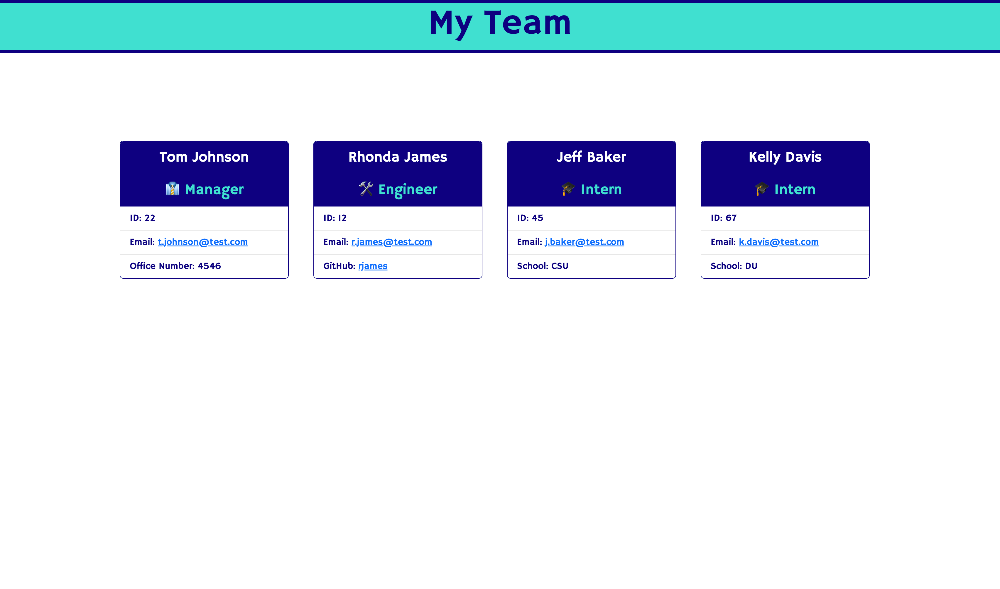

# Team Profile Generator

## Description

Use this Team Profile Generator to quickly generate a webpage that will display your team's basic information. This will give you quick access to their email address and GitHub profiles. Answer a few questions about your team and an HTML file will be generated that will display a nicely formatted team roster. When you click on one of the team members email addresses it will automatically launch your default email program and will populate the To: field making sending emails quick and easy. Like wise, clicking on a team members GitHub username will take you directly to their corresponding GitHub profile.

[Link to video Demonstration](https://drive.google.com/file/d/1hkZUB1H2bZcbjzyiJH7jd5YFykh6uPih/view)

---

## Table of Contents

- [Screenshot](#screenshot)
- [Installation](#installation)
- [License](#license)
- [Tests](#tests)
- [Questions](#questions)

---

## Screenshot

---

## Installation

To install the necessary dependancies, run the following command:

npm i

---

## License

none

---

## Tests

To run tests, run the following command:

npm run test

---

## Questions

Contact me with any questions about the repo or report any issues at eebbinghaus@gmail.com

Find more of my projects at my GitHub: [eebbinghaus](https://github.com/eebbinghaus)
